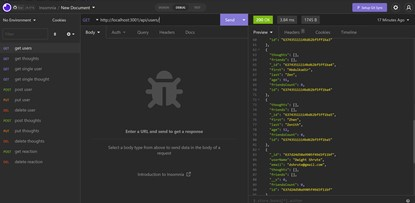
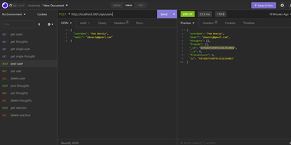
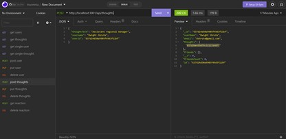

# Social-Network-API

## Descrpition 
This noSQL api is a mockup of a social network application. This api stores data which allows users to create user accounts, share thoughts, react to other user's thoughts, and add friends. The user's can add, update, and delete user accounts. They can add and delete thoughts. They can add rections and delete reactions to other user's thoughts. Additionally, the users can add and delete friends.  

## Installation
* link to walkthrough video: https://youtu.be/juJVj1TfAPg
* link to GitHub: https://github.com/ckrum21/Social-Network-API

Install this website by cloning the code to your local devices.

software required to download this website:
* GitBash or other terminal
* Visual Studio Code

## Usage

The code used for this webpage is HTML, CSS, JavaScript, Express.js, and Mongoose.

## Credits
Chelsea Krum 